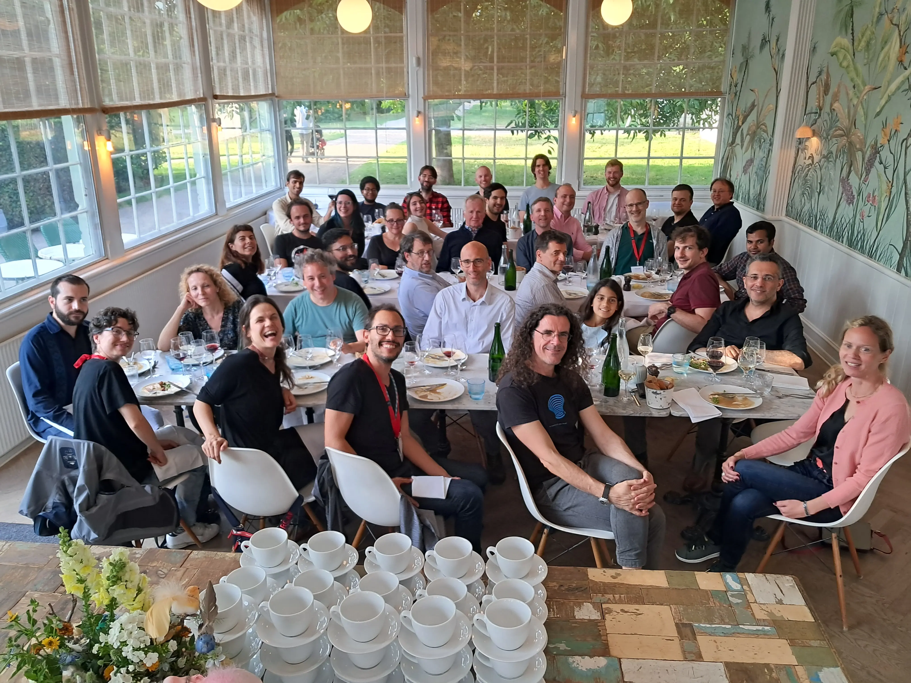
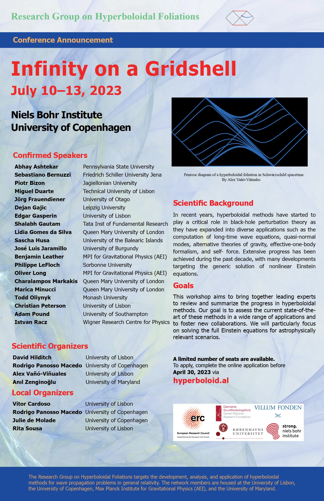

<meta charset="utf-8">

## Schedule

  

  <table>
    <tr>
      <th>Time</th>
      <th>Mon, 10 Jul</th>
      <th>Tue, 11 Jul</th>
      <th>Wed, 12 Jul</th>
      <th>Thu, 13 Jul</th>
    </tr>
    <tr>
      <td>8:30—8:45</td>
      <td class="break">Coffee and Tea</td>
      <td class="break" colspan="3" rowspan="2">Coffee and Tea</td>
    </tr>
    <tr>
      <td>8:45—9:00</td>
      <td>Welcome</td>
    </tr>
    <tr>
      <td>9:00—9:45</td>
      <td><a href=/copenhagen-23-talks#abhay-ashtekar>Abhay Ashtekar</a></td>
      <td><a href=/copenhagen-23-talks#sascha-husa>Sascha Husa</a></td>
      <td><a href=/copenhagen-23-talks#sebastiano-bernuzzi>Sebastiano Bernuzzi</a></td>
      <td><a href=/copenhagen-23-talks#florian-beyer>Florian Beyer</a></td>
    </tr>
    <tr>
      <td>9:45—10:30</td>
      <td><a href="/copenhagen-23-talks#adam-pound">Adam Pound</a></td>
      <td><a href=/copenhagen-23-talks#shalabh-gautam>Shalabh Gautam</a></td>
      <td><a href=/copenhagen-23-talks#manas-vishal>Manas Vishal</a></td>
      <td><a href=/copenhagen-23-talks#istván-rácz>István Rácz</a></td>
    </tr>
    <tr>
      <td>10:30—11:00</td>
      <td class="break" colspan="4">Coffee and Tea</td>
    </tr>
    <tr>
      <td>11:00—11:45</td>
      <td><a href=/copenhagen-23-talks#barry-wardell>Barry Wardell</a></td>
      <td><a href=/copenhagen-23-talks#miguel-duarte>Miguel Duarte</a></td>
      <td><a href=/copenhagen-23-talks#charalampos-markakis>Charalampos Markakis</a></td>
      <td><a href=/copenhagen-23-talks#philippe-lefloch>Philippe LeFloch</a></td>
    </tr>
    <tr>
      <td>11:45—12:30</td>
      <td><a href=/copenhagen-23-talks#benjamin-leather>Benjamin Leather</a></td>
      <td><a href=/copenhagen-23-talks#christian-peterson>Christian Peterson</a></td>
      <td><a href=/copenhagen-23-talks#todd-oliynyk>Todd Oliynyk</a></td>
      <td><a href=/copenhagen-23-talks#marica-minucci>Marica Minucci</a></td>
    </tr>
    <tr>
      <td>12:30—14:00</td>
      <td class="break" colspan="4">Lunch</td>
    </tr>
    <tr>
      <td>14:00—14:45</td>
      <td><a href=/copenhagen-23-talks#lidia-gomes-da-silva>Lidia Gomes da Silva</a></td>
      <td><a href=/copenhagen-23-talks#edgar-gasperin>Edgar Gasperin</a></td>
      <td><a href=/copenhagen-23-talks#dejan-gajic>Dejan Gajic</a></td>
      <td><a href=/copenhagen-23-talks#jason-joykutty>Jason Joykutty</a></td>
    </tr>
    <tr>
      <td>14:45—15:30</td>
      <td><a href=/copenhagen-23-talks#oliver-long>Oliver Long</a></td>
      <td><a href=/copenhagen-23-talks#jörg-frauendiener>Jörg Frauendiener</a></td>
      <td><a href=/copenhagen-23-talks#josé-luis-jaramillo>José Luis Jaramillo</a></td>
      <td><a href=/copenhagen-23-talks#alex-vañó-viñuales>Alex Vañó-Viñuales</a></td>
    </tr>
    <tr>
      <td>15:30—16:00</td>
      <td class="break" colspan="4">Coffee and Tea</td>
    </tr>
    <tr style="height: 100px;">
      <td>16:00—17:00</td>
      <td>Roundtable Self-force</td>
      <td>Roundtable Einstein equations</td>
      <td>Roundtable BH perturbations</td>
      <td>Roundtable Future projects</td>
    </tr>
  </table>

### Conference Photos

#### Workshop

#### Dinner

### Streaming
Talks will be streamed online. If you are interested in attending online, please register [here](https://umd.zoom.us/meeting/register/tJ0lc-2trzosE9NChGpai9-h_EXjW1xxRvd_).

### Activities

**Tour of NBI Archives**, Monday, 10 July, and Tuesday, 11 July, at 17:30.

The [Niels Bohr Institute](https://en.wikipedia.org/wiki/Niels_Bohr_Institute) (NBI) where the workshop will take place was founded by [Niels Bohr](https://en.wikipedia.org/wiki/Niels_Bohr) in 1921. NBI has played a crucial role in shaping the development of quantum mechanics and quantum information theory. A tour of the institute's [archives](https://www.nbarchive.dk/) will be offered on Monday and Tuesday at 17:30. The tour is free of charge and will last approximately 1 hour.

**Conference Dinner**, Wednesday, 12 July, 18:30.

The conference dinner will take place on Wednesday, 12 July, at 18:30 at [Restaurant Orangeriet](https://en.restaurant-orangeriet.dk/hjem) located at [Kronprinsessegade 13](https://www.google.com/maps?q=Kronprinsessegade+13,+1306,+Copenhagen+K,+DK) by the [Rosenborg Castle Gardens](https://en.wikipedia.org/wiki/Rosenborg_Castle_Gardens). 

The cost is 200 DKK for postdocs/faculty and 150 DKK for PhD students.

<!-- Please use this [link](https://science.nemtilmeld.dk/1699/at-INFINITY/) to register for the conference dinner. 

<!-- ### Confirmed Speakers

<table class="table table-hover table-sm">
  <thead class="thead-dark">
    <tr>
      <th scope="col">Name</th>
      <th scope="col">Affiliation</th>
    </tr>
  </thead>
  <tbody>
<tr>
  <td>Abhay Ashtekar</td>
  <td>Pennsylvania State University</td>
</tr>
<tr>
  <td>Sebastiano Bernuzzi</td>
  <td>Friedrich Schiller University Jena</td>
</tr>
<tr>
  <td>Florian Beyer</td>
  <td>University of Otago</td>
</tr>
<tr>
  <td>Piotr Bizon</td>
  <td>Jagiellonian University</td>
</tr>
<tr>
  <td>Miguel Duarte</td>
  <td>Technical University of Lisbon</td>
</tr>
<tr>
  <td>Jörg Frauendiener</td>
  <td>University of Otago</td>
</tr>
<tr>
  <td>Dejan Gajic</td>
  <td>Leipzig University</td>
</tr>
<tr>
  <td>Edgar Gasperin</td>
  <td>University of Lisbon</td>
</tr>
<tr>
  <td>Shalabh Gautam</td>
  <td>International Centre for Theoretical Sciences</td>
</tr>
<tr>
  <td>Lidia Gomes da Silva</td>
  <td>Queen Mary University of London</td>
</tr>
<tr>
  <td>Sascha Husa</td>
  <td>University of the Balearic Islands</td>
</tr>
<tr>
  <td>José Luis Jaramillo</td>
  <td>University of Burgundy</td>
</tr>
<tr>
  <td>Jason Joykutty</td>
  <td>University of Cambridge</td>
</tr>
<tr>
  <td>Benjamin Leather</td>
  <td>MPI for Gravitational Physics (AEI)</td>
</tr>
<tr>
  <td>Philippe LeFloch</td>
  <td>Sorbonne University</td>
</tr>
<tr>
  <td>Oliver Long</td>
  <td>MPI for Gravitational Physics (AEI)</td>
</tr>
<tr>
  <td>Charalampos Markakis</td>
  <td>Queen Mary University of London</td>
</tr>
<tr>
  <td>Marica Minucci</td>
  <td>Queen Mary University of London</td>
</tr>
<tr>
  <td>Todd Oliynyk</td>
  <td>Monash University</td>
</tr>
<tr>
  <td>Christian Peterson</td>
  <td>University of Lisbon</td>
</tr>
<tr>
  <td>Adam Pound</td>
  <td>University of Southampton</td>
</tr>
<tr>
  <td>István Rácz</td>
  <td>Wigner Research Centre for Physics</td>
</tr>
<tr>
  <td>Manas Vishal</td>
  <td>University of Massachusetts Dartmouth</td>
</tr>
<tr>
  <td>Barry Wardell</td>
  <td>University College Dublin</td>
</tr>

  </tbody>
</table> -->

## Conference Poster

---

## Researchers

**Scientific Organizing Committee:** David Hilditch, Rodrigo Panosso Macedo, Alex Vañó-Viñuales, and Anıl Zenginoğlu

**Local Organizing Committee:** Vitor Cardoso, Julie de Molade, Rita Sousa

---

## Funding

<section class="logo-list">
    

        

          

                
            

            

                
            

            

                
            

        

        

            

                
            

            

                
            

            

                
            

        

    

</section>

---
