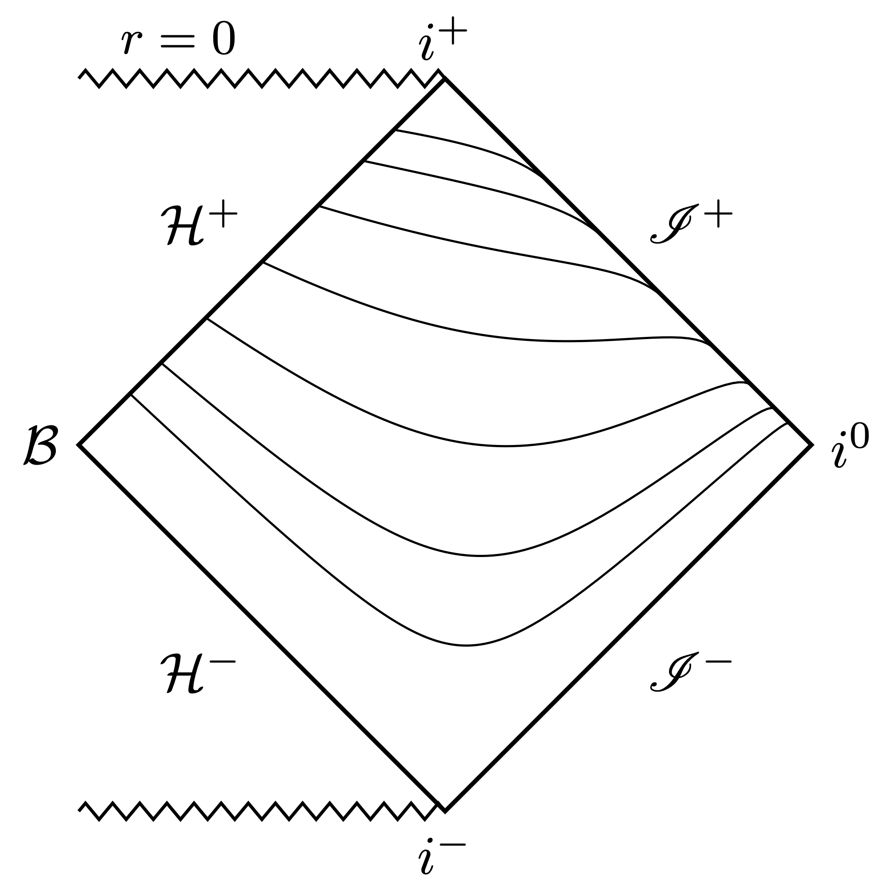

There is a flavor of hyperboloidal compactification commonly used in perturbation theory that goes under the name "minimal gauge." The associated time slices extend smoothly between the event horizon and null infinity. Minimal gauge was first proposed by [Schinkel, Ansorg, and Macedo](https://arxiv.org/abs/1301.6984) in 2013. The main advantage of minimal gauge over other smooth hyperboloidal foliations of the exterior Schwarzschild domain is its algebraic simplicity. The purpose of the post is to provide a derivation of minimal gauge that emphasizes its simplicity.

To bring things in context, we'll start with regular coordinates across black-hole horizons, which are called horizon-penetrating.

## Horizon-penetrating coordinates
Consider the 1+1 Schwarzschild spacetime with coordinates $(t,r)\in (-\infty,\infty)\times (1,\infty)$ and metric
$$ ds^2 = -f dt^2 + \frac{1}{f} dr^2, \qquad f := 1-\frac{1}{r}.$$ 
For convenience, I scaled the mass parameter out of the Schwarzschild metric by redefining coordinates with the constant $2M$ scale factor. The metric above is singular at $r=1$. 

This singularity caused a lot of confusion in the early years of general relativity. Today, we know that the singularity at the horizon is just a coordinate artefact. In fact, the coordinate location $r=1$ is not the three-dimensional horizon surface, but the two-dimensional bifurcation sphere (in 4D), which doesn't exist in a reasonable, physical collapse scenario. The curvature is regular at the bifurcation sphere, so we can just transform the coordinate singularity away using a suitably regular time coordinate. Below is a Penrose diagram that demonstrate the intersection of the time slices at the bifurcation sphere, $\mathcal{B}$.

The simplest way to construct a regular time coordinate across the event horizon is via a height function
$$ \tau = t -  h(r). $$
The height function, $h(r)$, lifts up the time slices depending on the radial coordinate $r$. The first regular time coordinate across the Schwarzschild event horizon was devised independently by [Painlevé and Gullstrand](https://en.wikipedia.org/wiki/Gullstrand%E2%80%93Painlev%C3%A9_coordinates). Their height function
$$ h_{\textrm{PG}}(r) = -2 \sqrt{r} + \ln\frac{\sqrt{r}+1}{\sqrt{r}-1}, $$
is singular at the horizon. The resulting metric, however,
$$ ds^2 = - f d\tau^2 + \frac{2}{\sqrt{r}} d\tau dr + dr^2, $$
is regular. Another such coordinate is given by Eddington and Finkelstein
$$ h_{\textrm{EF}}(r) =  \ln(r-1) $$
with regular metric
$$ ds^2 = - f d\tau^2 + \frac{2}{r} d\tau dr + \left(1+\frac{1}{r}\right)dr^2. $$

A common feature in both constructions is the logarithmic singularity of the height function near the horizon. This behavior is reasonable. Schwarzschild coordinates are singular at the bifurcation sphere, so it takes another singularity to fix it. The leading order behavior of the height function near the horizon is
$$ h_{\textrm{horizon}}(r) \sim \ln|r-1|. $$

To understand where this comes from, we need to have a look at the null cone. The causal structure of a spacetime is determined by its null structure. We need to follow the light. Null surfaces are given by
$$ h_{\textrm{null}}(r) = \pm \int \frac{dr}{f(r)} = \pm (r + \ln |r-1|). $$ 
The positive sign is for ingoing, the negative sign is for outgoing null rays. Now we recognize the leading order behavior of ingoing null rays near the horizon $(r\to 1)$ as $\sim\ln(r-1)$, that appears in both Painlevé-Gullstrand and Eddington-Finkelstein coordinates.

|    |    |
| :----: | :----: |
|  |  |

But there's another singularity in the height function that is typically ignored: the height function for outgoing null rays blows up at infinity ($r\to\infty$).

## What about infinity?
The standard response to this observation is to ignore it because it happens at infinity. But there is a problem here with respect to the null structure. If you want a regular description of *both* in- and outgoing null rays, you should use regular coordinates at both the horizon and at infinity. The Penrose diagrams above clearly demonstrate that the time slices intersect at infinity. Not good!

So let's pick a time coordinate that takes care of the singularity at infinity as well. The behavior we want near infinity is
$$ h_{\textrm{infinity}}\sim - r - \ln r. $$ 
To construct our desired time coordinate, we need to combine these two desired behaviors. But we must be careful that the horizon height function doesn't mess up the infinity behavior, so we'll take off its leading large $r$ term, like this 
$$ h_{\textrm{horizon}}(r) \sim \ln|r-1| - \textcolor{blue}{\ln r}. $$
The blue term cancels the $r\to \infty$ behavior of the horizon height function (series expansion for large $r$: $\ln(r-1) = \ln r - 1/r + O(1/r^2)$). 

The minimal gauge is simply the combination of these two behaviors:
$$ h_{\textrm{MG}}(r) = \ln|r-1| - 2 \ln r - r. $$
In a sense, this is the simplest choice you can make respecting the leading order behaviors of the horizon and infinity height functions with respect to ingoing and outgoing null rays.

The metric reads
$$ ds^2 = -f d\tau^2 - 2 \left(1-\frac{2}{r^2}\right) d\tau dr + \frac{4(1+r)}{r^3} dr^2\,. $$ 
You can now apply your favorite spatial compactification to the radial coordinate so that the entire exterior Schwarzschild domain is mapped regularly to a finite domain that fits well into a computer. For example, compactification with $\sigma:=1/r$ maps the exterior domain $r\in[1,\infty)$ to $\sigma\in[0,1]$, where $\sigma=0$ is null infinity and $\sigma=1$ is the horizon. The metric reads
$$ ds^2 = \frac{1}{\sigma^2} \left(-f \sigma^2 d\tau^2 + 2 (1-2\sigma^2) d\tau d\sigma + 4 (1+\sigma) d\sigma^2\right). $$ 
 And below is the obligatory Penrose diagram. The slices are smoothly extending between the future event horizon and future null infinity, beautifully covering the exterior domain of Schwarzschild spacetime.
 

## Connection to Leaver's method
Fascinating connections to Leaver's continued fraction method for the calculation of quasinormal modes.
