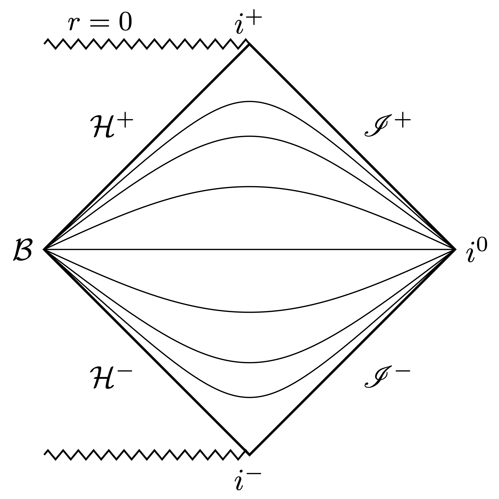
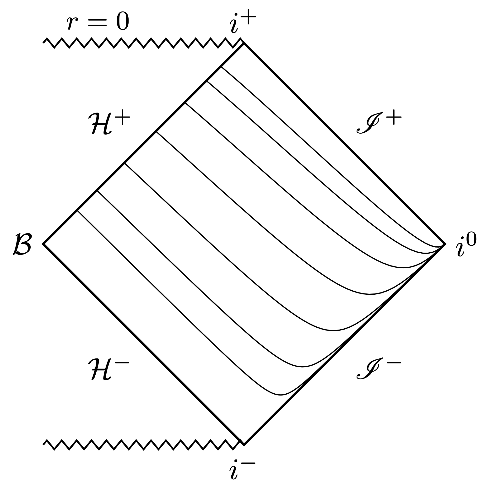
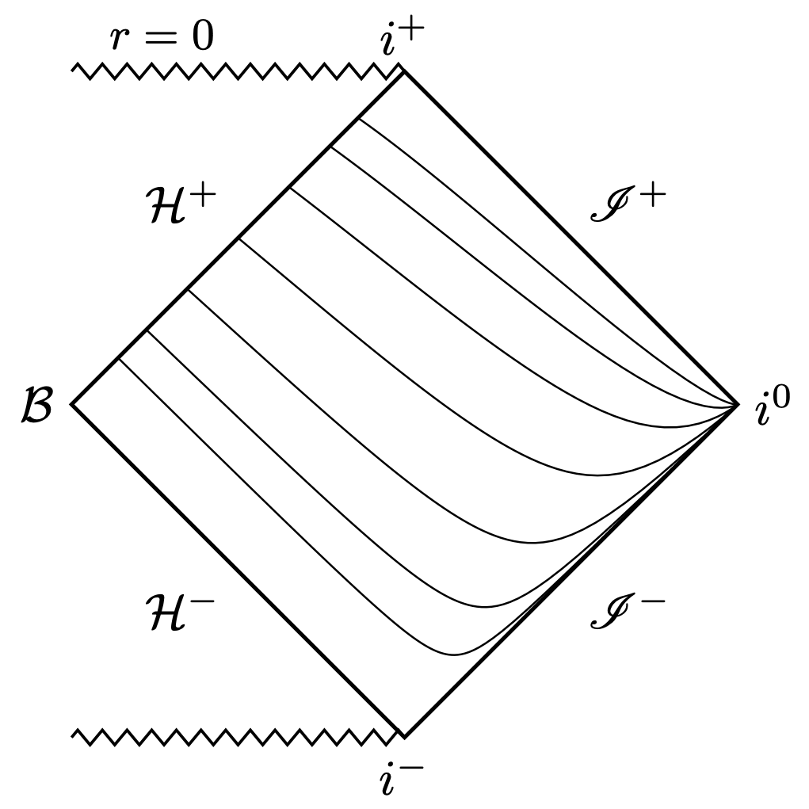

There is a flavor of hyperboloidal compactification commonly used in perturbation theory that goes under the name "minimal gauge." The associated time slices extend smoothly between the event horizon and null infinity. Minimal gauge was first proposed by [Schinkel, Ansorg, and Macedo](https://arxiv.org/abs/1301.6984) in 2013 and further formalised in the context of [Schwarzschild](https://arxiv.org/abs/1604.02261), [Reisnner-Nordstrom](https://arxiv.org/abs/1809.02837) and [Kerr](https://arxiv.org/abs/1910.13452) spacetimes. The main advantage of minimal gauge over other smooth hyperboloidal foliations of the exterior Schwarzschild domain is its algebraic simplicity. The purpose of the post is to provide a derivation of minimal gauge that emphasizes this simplicity.

To bring things in context, we'll start with regular coordinates across black-hole horizons, which are called horizon-penetrating.

## Horizon-penetrating coordinates
Consider the 1+1 Schwarzschild spacetime with coordinates $(t,r)\in (-\infty,\infty)\times (1,\infty)$ and metric
$$ ds^2 = -f dt^2 + \frac{1}{f} dr^2, \qquad f := 1-\frac{1}{r}.$$ 
For convenience, I scaled the mass parameter out of the Schwarzschild metric by redefining coordinates with the constant $2M$ scale factor. The metric above is singular at $r=1$. 

This singularity caused a lot of confusion in the early years of general relativity. Today, we know that the singularity at the horizon is just a coordinate artefact. In fact, the coordinate location $r=1$ is not the three-dimensional horizon surface, but the two-dimensional bifurcation sphere (in 4D), which doesn't exist in a reasonable, physical collapse scenario. The curvature is regular at the bifurcation sphere, so we can just transform the coordinate singularity away using a suitably regular time coordinate. Below is a Penrose diagram that demonstrates the intersection of the time slices at the bifurcation sphere, $\mathcal{B}$.

The simplest way to construct a regular time coordinate across the event horizon is via a height function
$$ \tau = t +  h(r). \tag{TT} \label{TT} $$
The height function, $h(r)$, lifts up the time slices depending on the radial coordinate $r$. The first regular time coordinate across the Schwarzschild event horizon was devised independently by [Painlevé and Gullstrand](https://en.wikipedia.org/wiki/Gullstrand%E2%80%93Painlev%C3%A9_coordinates). Their height function
$$ h_{\textrm{PG}}(r) = \ln(\sqrt{r}-1) - \ln(\sqrt{r}+1) + 2 \sqrt{r}, \tag{PG} \label{PG} $$
has a logarithmic singularity at the horizon. The resulting metric,
$$ ds^2 = - f d\tau^2 + \frac{2}{\sqrt{r}} d\tau dr + dr^2, $$
is regular. Another such time coordinate has been given by Eddington and Finkelstein[^1], also with a logarithmic singularity
$$ h_{\textrm{EF}}(r) =  \ln(r-1), \tag{EF} \label{EF} $$
leading to a regular metric
$$ ds^2 = - f d\tau^2 + \frac{2}{r} d\tau dr + \left(1+\frac{1}{r}\right)dr^2. $$

A common feature in both constructions is the logarithmic singularity of the height functions \eqref{PG} and \eqref{EF} near the horizon. This behavior is reasonable. Schwarzschild coordinates are singular at the bifurcation sphere, so it takes another singularity to fix it. The leading order behavior of both height functions near the horizon is
$$ h_{\textrm{horizon}}(r) \sim \ln(r-1).  \tag{horizon} \label{horizon}$$
But why this particular logarithmic singularity?

To understand where this comes from, we need to follow the light. The null surfaces in Schwarzschild coordinates are given by
$$ h_{\textrm{null}}(r) = \pm \int \frac{dr}{f(r)} = \pm (r + \ln |r-1|).  \tag{null} \label{null} $$ 
The null rays are ingoing (regular at future horizon) for the positive sign, outgoing (regular at future null infinity) for the negative sign. The leading order behavior of ingoing null rays near the horizon is $\sim\ln(r-1)$, as it appears in both Gullstrand-Painlevé and Eddington-Finkelstein coordinates, which explains why regular coordinates across the black-hole horizon in Schwarzschild spacetime must have this singularity structure in the height function.

|                                                  |                                                    |
| :----------------------------------------------: | :------------------------------------------------: |
|  |  |

Above are the Penrose diagrams depicting the time slices for Gullstrand-Painlevé and Eddington-Finkelstein coordinates. 

Inspecting these Penrose diagrams indicates that there is another intersection of time slices similar to the one we have just resolved near the bifurcation sphere. This time, the intersection is near spatial infinity. In fact, the height function for \ref{null} rays blows up at infinity!

## What about infinity?
The standard response to this observation is to ignore it because it happens at infinity. But there is a problem here with respect to the null structure. If you want a regular description of the energy propagation along *both* in- and outgoing null rays, you should use regular coordinates at both the horizon and infinity. The Penrose diagrams above clearly demonstrate that the time slices intersect at infinity. Not good!

So let's pick a time coordinate that takes care of the singularity at infinity as well. The behavior we want near infinity is one of an outgoing null ray, i.e., the minus sign in \eqref{null} with the leading order terms
$$ h_{\textrm{infinity}}\sim - r - \ln r.  \tag{infinity} \label{infinity}$$ 
To construct our desired time coordinate, we need to combine the two desired behaviors near the \ref{horizon} and \ref{infinity}. But we must be careful that the horizon height function doesn't mess up the infinity behavior, so we'll take off its leading large $r$ term, like this 
$$ h_{\textrm{horizon}}(r) \sim \ln|r-1| - \textcolor{green}{\ln r}. $$
The green term cancels the $r\to \infty$ behavior of the horizon height function.
<!-- (series expansion for large $r$: $\ln(r-1) = \ln r - 1/r + O(1/r^2)$).  -->

We're finally ready to construct the gauge that connects the horizon and null infinity smoothly. We simply combine these two behaviors and get the minimal gauge:
$$ h_{\textrm{MG}}(r) = \ln|r-1| - 2 \ln r - r. \tag{MG} \label{MG}$$
In a sense, this is the simplest, or minimal, choice you can make respecting the leading order behaviors of the horizon and infinity height functions with respect to ingoing and outgoing null rays.

The metric in this minimal gauge reads
$$ ds^2 = -f d\tau^2 - 2 \left(1-\frac{2}{r^2}\right) d\tau dr + \frac{4(1+r)}{r^3} dr^2\,. $$ 
You can now apply your favorite spatial compactification to the radial coordinate so that the entire exterior Schwarzschild domain is mapped regularly to a finite domain that fits well into a computer. For example, compactification with $\sigma:=1/r$ maps the exterior domain $r\in[1,\infty)$ to $\sigma\in[0,1]$, where $\sigma=0$ is null infinity and $\sigma=1$ is the horizon with metric
$$ ds^2 = \frac{1}{\sigma^2} \left(-f \sigma^2 d\tau^2 + 2 (1-2\sigma^2) d\tau d\sigma + 4 (1+\sigma) d\sigma^2\right). $$ 
Below is the obligatory Penrose diagram. The slices are smoothly extending between the future event horizon and future null infinity, beautifully covering the exterior domain of Schwarzschild spacetime.
 

## Connection to the Music of Black-Holes
The minimal gauge is a relatively new set of coordinates, having appeared only in [2013](https://arxiv.org/abs/1301.6984). Remarkably, there is a connection between the minimal gauge and a widely known method to calculate ringing frequencies of black holes.

When a black hole is perturbed, it rings with a characteristic frequency spectrum while emitting away the energy of the perturbation in a ringdown, just like a musical instrument, or a glass that has been tapped with a knife. Such decaying oscillatory perturbations are called [quasi-normal modes](https://en.wikipedia.org/wiki/Quasinormal_mode). The details of the ringdown, such as the frequency of oscillations and the rate of decay, depend on the physical parameters of the black hole. There is a vibrant research direction called black-hole spectroscopy that studies such black-hole quasi-normal modes.

The most prevalent method to compute black-hole ringdown frequencies was presented in a 1985 [paper](http://www.jstor.org/stable/2397876) by Leaver. The first step in Leaver's method is to write the perturbations in frequency domain via a Fourier transformation. For simplicity, we assume a scalar perturbation causing a harmonic oscillation with a single frequency $\omega$. We can then separate the space and time dependence of the perturbative field, $\phi(t,r)$, as
$$\phi(t,r) = e^{i\omega t}\psi(r).$$
It turns out that the frequency-domain perturbation blows up both near the horizon and near infinity. This perturbation blow-up is a consequence of the equations that the black-hole perturbations satisfy when they are written in Schwarzschild coordinates. You will immediately recognize the issue from our previous discussion. The perturbation blows up simply because the Schwarzschild time slices intersect both near the horizon and near infinity.

The pathology of Schwarzschild time slices and its relationship to the pathologies of black-hole perturbations were not recognized during Leaver's time. Instead, Leaver used traditional tools from the theory of ordinary differential equations and suggested a rescaling to pick up the perturbative field's pathological behavior
$$
\psi(r) = r^{2i\omega} \left(r - 1\right)^{-i\omega}  e^{i\omega r} \overline \psi_{\rm L}(r). \tag{L}\label{L}
$$
He then performed a Taylor expansion around the horizon for the regularized perturbation
$$
\overline \psi_{\rm L}(r) = \sum_{k=0}^{\infty} a_k \left( 1-\frac{1}{r} \right)^k.
$$
The coefficients of the expansion, $a_k$, satisfy a $3$-term recurence relation which we can now iteratively solve for. This method is the most common method to compute black-hole frequencies to this day.

### A geometric framework

It is not immediately clear where Leaver's regularization in \eqref{L} comes from. We can, however, solve the problem of perturbation blow-up that motivated Leaver's regularization in a [geometric way](https://arxiv.org/abs/1102.2451) by switching to regular coordinates. The time transformation with a height function as in \eqref{TT} translates to a rescaling of the perturbation in frequency domain. To see this, note that the scalar perturbation in the new time $\tau$ is the same as the perturbation in Schwarzschild time
$$ \phi(\tau,r) = \phi(t+h(r),r) = \phi(t,r).$$
The separation ansatz then implies
$$\phi(\tau,r) = e^{i\omega \tau} \overline\psi(r) = e^{i\omega t} e^{i \omega h} \overline\psi(r)  = e^{i\omega t} \psi(r).$$
Therefore, the irregular perturbation in Schwarzschild time, $\psi(r)$, is related to the perturbation in transformed time, $\overline\psi(r)$, as
$$ \psi(r) = e^{i \omega h} \overline\psi(r).$$
The most important property here is that the transformed perturbation, $\overline \psi(r)$, is regular at the horizon and infinity due to the leading order singular behavior of the height function in these regimes, which picks up the blow-up of the Schwarzschild perturbation, $\psi(r)$.

To make the connection between Leaver's regularization and the time transformation \eqref{TT}, we rewrite Leaver's regularization in \eqref{L} as
\begin{eqnarray}
r^{2i\omega} \left(r - 1\right)^{-i\omega} &=& e^{-2i\omega\ln r} e^{i\omega \ln(r-1)} e^{-i\omega r} \newline
&=& e^{i\omega (-2 \ln r + \ln (r-1) - r)}.
\end{eqnarray}
Remarkably, this is **exactly** the same function as the minimal gauge height function given in \eqref{MG}! Leaver's regular field $\overline\psi_{\rm L}(r)$ is the frequency-domain representation of the hyperboloidal pertubation field $\phi(\tau,r)$ in the minimal gauge.

<!-- 
## Event and Cauchy Horizons: the role of the compactification

The geometrical approach unveils an even richer structure for spacetimes containing a Cauchy horizon $r_{c}$ apart from the event horizon $r_h$. The most straightfoward exemples are charged and rotating black holes, described the well-known Reisnner-Nordstrom and Kerr spacetimes, respectvely.

Usually, these solutions are parametrised by another paramerter apart from the black hole mass M: the electric charged $Q$ in the Reisnner-Nordstrom case, or the angular momentum $a$ for the Kerr solution. These parameters are restricted to values $|Q|/M\leq 1$ and $|a|/M\leq 1$. The equality holds in the the so-called extremal black holes. In such cases, it follows that the event and Cauchy horizons coincide.

Because we are opting to normalise the event horizon to unit, a more conveninet parameter in terms of the ratio between the event and Cauchy horizon via
$$
\kappa^2 = \dfrac{r_c}{r_h} = r_{c}^{-1}.
$$ 
Indeed, one can verify that $\kappa = Q/r_{h}$ (Reisnner-Nordstrom) or $\kappa=a/r_{h}$ (Kerr), which reduces to the usual charge and angular momentum parameters when $r_h=1$. Besides, this parameter takes values in the range $|\kappa|\in[0,1]$, with $\kappa=0$ describing the Schwarzschild space time, and $\kappa\rightarrow 1$ the extremal limit.

Constructing the minimal gauge for these spacetimes follows a similar strategy as described previously, i.e., a deformation of the time coordinate $t$ via the height function $h$, and a compactification of radial coordinate $r$. Here, we consider both transformations and we focus on the role played by the choice of compactification function within the minimal gauge. Specifically, we transform the coordinates $(t,r)$ into $(\tau,\sigma)$ via
\begin{eqnarray}
t = \tau - h(\sigma), \quad r = \dfrac{\rho(\sigma)}{\sigma}.
\end{eqnarray}
In the miminal gauge, the height function has the form
$$
h(\sigma) = h_{null}^-(r(\sigma)) + \delta h(\sigma), \quad \delta h(\sigma) = 2\left(\ln \sigma -\sigma^{-1} \right)
$$
with $h_{null}^-$ the solution with negative sign in \ref{null}.

The influce of the radial compactification in the coordinate transformation is capture by the function $\beta(\sigma) \equiv \rho'(\sigma) - \sigma \rho(\sigma)$. The minimal gauge imposes the simple value $\beta(\sigma) = 1$, which translates into 
$$
\rho(\sigma) = \rho_0 + (1-\rho_0) \sigma.
$$
This choice already considers the event horizon fixed at $r_h=1 \leftrightarrow$ $\sigma_h=1$. 

Of course, the most simple option is just just set $\rho_0=1$, from which we recover the compactification $r=1/\sigma$. Besides, with this choice, the Cauchy horizon assumes the coordinate value $\sigma_c= \kappa^{-2}$. Thus, we observe that the coordinate location of the Cauchy horizon moves continously along the grid from $\sigma_c\rightarrow \infty$, i.e., the singularity in the Schwarzschild spacetime when $\kappa=0$, up to $\sigma_c = \sigma_h = 1$ in the extremal case $\kappa^2=1$. With this choice of hyperboloidal compactification, the line element in the limit $\kappa^2=1$ corresponds to the usual representation of extreme black holes.

Interstingly, we can exploit the parameter $\rho_0$ to actually fix the Cauchy horizon at a given coordinate grid. In particular, the choice $\rho_0 = 1 - \kappa^2$ leads to the radial compactification
$$
r = \dfrac{ 1 - \kappa^2(1-\sigma)}{\sigma}.
$$
This choice ernsures that the Cauchy horizon is always at $\sigma_c\rightarrow \infty$, regardless of $|\kappa| \in [0, 1)$. We will refer to this choice as Cauchy Horizon fixing minimal gauge.

However, the transformation (and therefore the underlying line element) is ill-defined for $\kappa^2 = 1$ as it reduces to $r=1$. However, a well-defined limit for the metric components is achieved if we re-scale the time coordinate accordingly to $\tau \rightarrow \tau/(1-\kappa^2)$. Even though, the radial and time re-scaling are singular in the extremal limit $\kappa^2 \rightarrow 1$, the line element is well-defined and describes the so-called near-horizon geometry of extremal black holes. The discontinous limiting process is not a feature of the coordinate transformation. The geometry of extremal black-holes in the near-horizon regime is also discontious in the sense that future null infinity changes its character from being a lightlike surface (asymptotically flat spacetime) to being timelike (asymptotically $AdS_2$ spacetime).

Going back to Leaver's approach to regularise the equations in the frequency domain, it is well-known that his approaches fails in the extremal limit. In other words, an algorithm for computing the QNM of extremal black-hols following his initial ideas cannot be achieve in a continous way, but rahter one must be considered the line element in its extremal regime from scratch. While this limiation has been understood just as caveat of the algorithm, the hyperboloidal approach shows that the limitation is actually a consequence of discontinous transition to the near-horizon geometry (and its change in topology) in the extremal case.

Indeed, in this post, we saw that Leaver's regularisation choice follows naturally from the hyperboloidal transformation via a pre-factor $e^{i\omega h}$. It turns out that, for spacetimes containing a Cauchy horizon, Leaver's regularization factor corresponds exactly to the hyperboloidal formulation in the {\it Cauchy Horizon fixing minimal gauge}. Thus, the algorithm's breakdown is a consequence of the discontinous limit into the near-horizon geometry.

  -->

[^1]: In today's literature, [Eddington-Finkelstein](https://en.wikipedia.org/wiki/Eddington%E2%80%93Finkelstein_coordinates) coordinates are adapted to radial null geodesics. However, the original coordinates by Eddington from 1924 and Finkelstein from 1958 both use a time coordinate as described in this post. 
