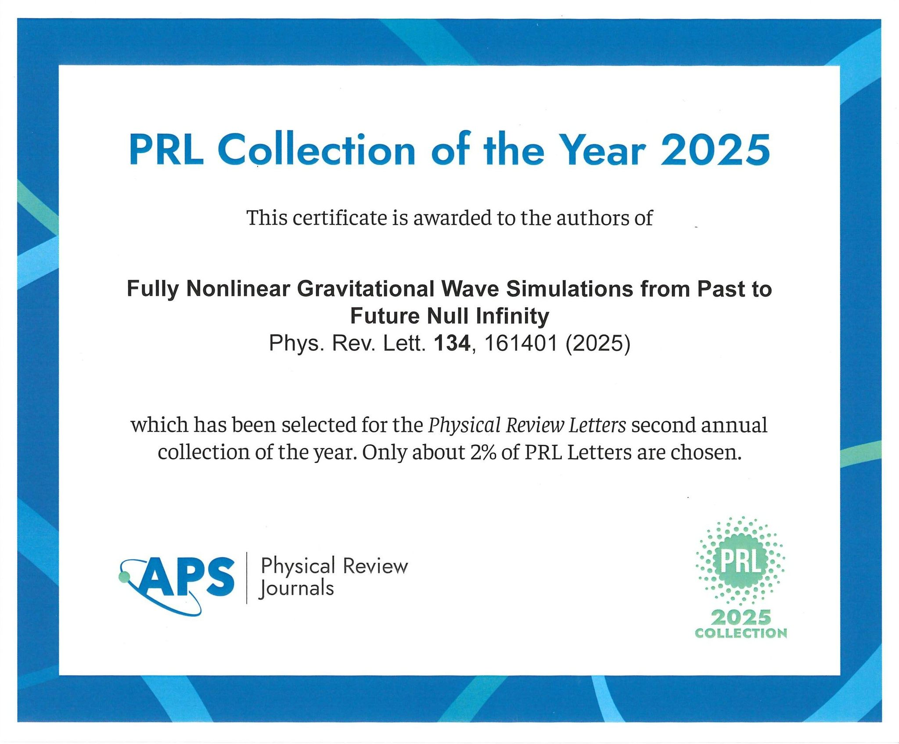
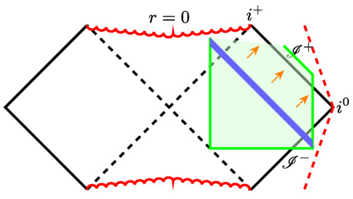

We are delighted to share that our letter, “Fully Nonlinear Gravitational Wave Simulations from Past to Future Null Infinity”, has been selected for the 2025 Physical Review Letters Collection. Only around 2% of papers published in Physical Review Letters are chosen for inclusion, making this a particularly meaningful recognition of the work. Only six were chosen within the fields of Astrophysics, Cosmology and Gravitation, including letters by the LIGO/VIRGO and IceCube collaborations.

The letter, co-authored with my PhD student Sebenele Thwala and my former PhD supervisor and longtime collaborator Jörg Frauendiener, presents the first fully nonlinear numerical simulations of asymptotically flat spacetimes whose computational domain simultaneously includes both past null infinity $\mathscr{I^-}$ and future null infinity $\mathscr{I}^+$. The work is based on Friedrich's Generalized Conformal Field Equations (GCFE), which reformulate Einstein's equations in a conformally compactified spacetime so that infinity becomes part of the finite computational domain rather than an external limit. This allows us to evolve gravitational radiation from its asymptotic origin at $\mathscr{I^-}$, through the strong-field region surrounding a black hole, and back out to $\mathscr{I^+}$, where gravitational-wave observables are naturally defined.

The motivation for this work comes from gravitational-wave scattering. In many areas of physics, scattering theory provides a bridge between incoming and outgoing states, allowing one to understand how interactions transform one into the other. For gravity, this naturally leads to the question of how incoming radiation prescribed on $\mathscr{I^-}$ is related to outgoing radiation observed on $\mathscr{I^+}$. While this problem has been extensively studied analytically in mathematical relativity, primarily through investigations of the existence, regularity, and asymptotic structure of broad classes of solutions, a fully nonlinear numerical treatment of specific gravitational-wave scattering processes has remained largely inaccessible because conventional formulations of Einstein's equations do not provide direct access to null infinity.

In our simulations, we use an initial boundary value problem (IBVP) formulation with the initial surface extending beyond $\mathscr{I}^-$. This allows us to generate an ingoing gravitational wave on the outer boundary *outside* of $\mathscr{I}^-$ which propagates in and implicitly imprints data there. This allows us to use the currently existing capabilities of our IBVP formulation to investigate the scattering problem. We are then able to track the resulting nonlinear dynamics throughout the entire spacetime and compute asymptotic quantities such as the Bondi energy and Bondi news on both null infinities. This makes it possible to investigate, for the first time in a fully nonlinear setting, how information encoded in incoming radiation is reflected in the asymptotic structure of the outgoing spacetime. Among other results, we observe nonlinear generation of higher multipoles and quantify how the fraction of incoming energy re-emitted as outgoing radiation increases with wave amplitude.

In saying the above works within existing capabilities, there are clear paths toward a full scattering framework. The first is the ability to generate an initial data set *directly* on $\mathscr{I}^-$ with prescribed regularity. Regularity has been discussed by Friedrich, Chrusciel, Paetz and more recently Kroon and Taujanskas, in the neighbourhood’s of past timelike infinity and the bottom of the cylinder. However, a discussion of full initial data sets has been lacking. A paper soon to be submitted to the arXiv with Jörg Hennig at the University of Otago and students deals with this problem and the associated questions regarding regularity and how to generate initial data sets for a prescribed ingoing wave for the spin-2 equation linearised around Minkowski space-time. It also deals with the other elephant in the room – spatial infinity. A numerical procedure is proposed and implemented showcasing how one can evolve such data numerically through the cylinder. These are steps toward a fully global nonlinear simulation strategy for asymptotically flat space-times.

The current work also sits within a much broader effort being undertaken across the hyperboloidal and conformal relativity communities. Considerable progress has been made over recent years in the development of hyperboloidal foliations, conformal methods, characteristic methods, and related approaches that bring null infinity into numerical calculations, each with their own advantages and disadvantages. These techniques are motivated by a common goal: obtaining a mathematically rigorous and physically faithful description of radiative spacetimes directly at infinity, where gravitational-wave observables are unambiguously defined.

Although our approach differs from standard hyperboloidal evolutions by employing Friedrich's conformal field equations, compactifying in time and incorporating both $\mathscr{I}^-$ and $\mathscr{I}^+$ within a single computational framework, it shares the same underlying philosophy. The recognition of this work by Physical Review Letters therefore highlights not only the specific results presented in the paper, but also the growing importance of hyperboloidal and conformal methods throughout gravitational physics. As questions concerning asymptotic symmetries, memory effects, conservation laws, gravitational-wave scattering and waveforms from compact binaries continue to attract attention, the ability to access null infinity directly is becoming increasingly central to both numerical and mathematical relativity.

For us, this recognition is a gratifying acknowledgement of years of development in conformal numerical relativity and a reminder that understanding the global structure of spacetime remains one of the most fundamental challenges in gravitational physics.

